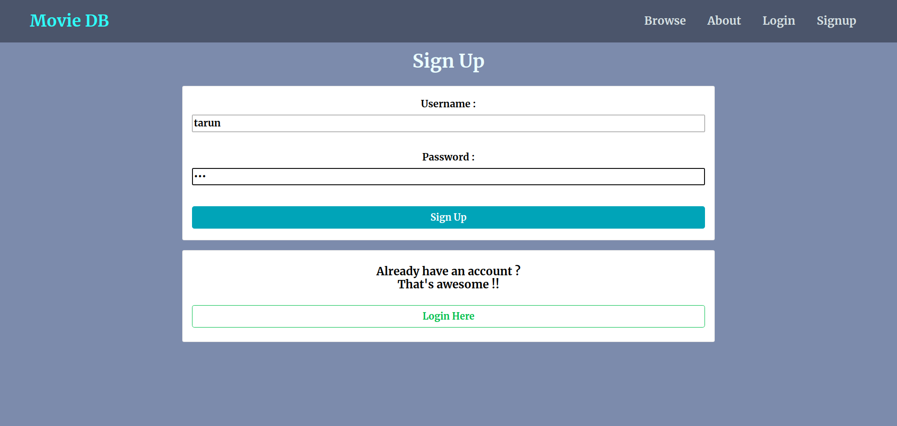
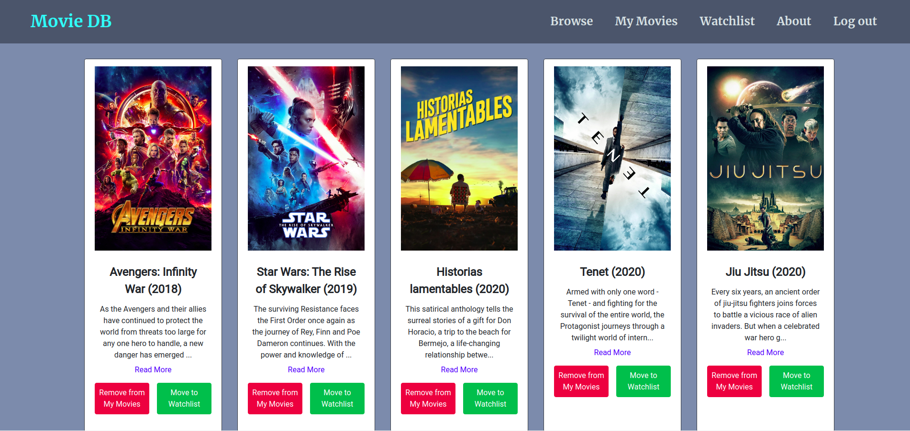
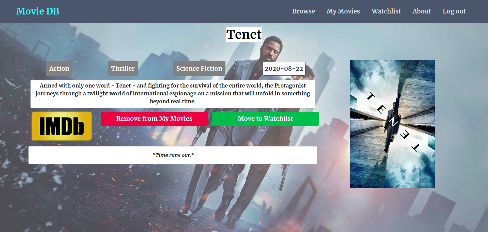

# Movie DB Project - React

This is a practice project made using React JS (for frontend), ExpressJS Backend with MongoDB.
This project aims to create Movie Database searching and filtering using title or genres interface.
Users can sort movies into lists as per their wish.
The backend stores user information with their lists.
<br>
This project uses various technologies like :

<ul>
<li>ReactJS
<li>ExpressJS
<li>MongoDB
<li>Semantic UI CSS
</ul>
<br>
All movie related information is fetched from a third party API - <a href="https://www.themoviedb.org" target="_blank">themoviedb.org</a>.

The project can be viewed <a href="https://movie-db-reactjs.herokuapp.com/" target="_blank">here</a>.

# Screenshots

<br>
<br>
<br>
<br>
<br>


## Setting up the project

1. **Clone this repository**

```
git clone git@github.com:tarunluthra123/MovieDB-React.git
```

2. **Install dependencies**

Open the folder and install all the dependencies

```
npm install
```

3. **Setting up the .env file**

Create a .env file which contains a variable MONGO_URL variable. This must point to your Mongo database. You can refer to the .env-sample file.
<br>

4. **Start your project**

Open two terminals.
In the first terminal, start the server

```
npm start
```

This will start the server on port 5000. Change port number in server.js if you wish to run server on another port.

In the second terminal, start the react development server.

```
npm run start-react
```

The project is up and running.
